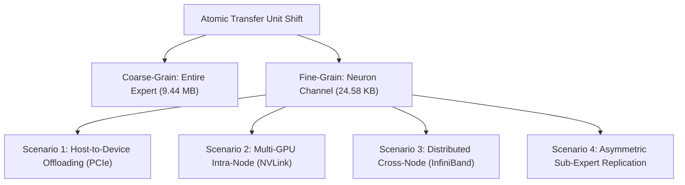

# Paradigm Shift: Neuron Channels as the Fundamental Unit of Data Movement for MoE Systems

Historically, MoE serving frameworks (e.g., DeepEP, ZeRO-Inference, FlexGen, FMoE) have treated the **entire expert** as the atomic unit of data movement, caching, and replication. This coarse-grained approach causes massive overhead: when a token routing decision dispatches to a offloaded expert, the system must transfer the entire expert weight parameter block, even if only a tiny fraction of its neurons activate.

**Activation-Aware Expert Caching (AAEC)** proposes a paradigm shift: **introducing the neuron channel as the fundamental, fine-grained unit of data movement for MoE serving.** 

By re-architecting the serving abstraction from the expert level ($9.44\text{ MB}$) to the neuron channel level ($24.58\text{ KB}$), we enable fine-grained caching, asymmetric replication, and multi-tier memory hierarchies that drastically reduce bandwidth and latency.

---



---

## 1. Concrete Serving Scenarios

### Scenario 1: Single-Node CPU-GPU Offloading
In cost-constrained or consumer hardware setups (e.g., llama.cpp or CPU-GPU hybrid runtimes), the total MoE model weights exceed GPU HBM VRAM, forcing experts to reside in host CPU memory.
*   **The Baseline:** When a token routes to a CPU-offloaded expert, the engine transfers the entire $18.87\text{ MB}$ expert (for a 30B model) over the PCIe Gen5 bus to the GPU. This introduces a $300\text{ \mu s}$ latency tax per layer.
*   **The AAEC Granularity:** The engine transfers only the missing neuron channel packets (each packet containing gate, up, and down projection columns for a single neuron, totaling $24.58\text{ KB}$).
*   **Performance Impact:** Real H100 hardware validation shows that transferring only the active columns reduces FFN layer latency to **$47.45\text{ \mu s}$**, yielding a **6.34x end-to-end serving speedup**.

---

### Scenario 2: Multi-GPU Intra-Node Transfers
In a single node with multiple GPUs (e.g., 8× H100 connected via NVLink), experts are partitioned across GPUs (Tensor/Pipeline Parallelism).
*   **The Baseline:** If GPU0 executes a token that the router dispatches to Expert 42 (which resides on GPU2), GPU2 must transfer the entire Expert 42 parameter weights to GPU0.
*   **The AAEC Granularity:** GPU2 transfers only the active neuron columns required for the active token. At 50% activation energy, only 115.5 out of 768 columns are copied, reducing NVLink bus load by **85.0%**.

---

### Scenario 3: Distributed Cross-Node Clusters
In large-scale distributed clusters, inference is split across multiple physical nodes connected via InfiniBand or Ethernet.
*   **The Baseline:** When a token dispatched on Node A requires an expert residing on Node C, the entire expert parameter weight must be serialized and transmitted over the network interface.
*   **The AAEC Granularity:** Node C transmits only the specific active neuron channel packets required for the current token sequence, bypassing network serialization bottlenecks.

---

## 2. Asymmetric Sub-Expert Replication

In distributed MoE serving, replicating experts across nodes is highly effective for reducing communication overhead, but it incurs a massive GPU memory footprint tax. 

AAEC introduces **Asymmetric Sub-Expert Replication**:

```
GPU0 HBM (Replicated Hot Sub-Expert Cache)
[ Expert 42 Hot Columns (Top 10% / 600 KB) ] --> Local Execution (High Hit Rate)
                                                    |
                                             (If Cache Miss)
                                                    |
                                                    v
[ Remote HBM / DRAM: Fetch Cold Columns (24.58 KB) on demand ]
```

### The Mechanism
1.  Using our empirical active-stability classification, we identify the **Always Hot** (0.89%) and highly active **Context Hot** neurons per expert (accounting for the top 10% of cumulative activation energy).
2.  Instead of replicating the entire $9.44\text{ MB}$ expert across all nodes, we replicate **only the top 10% hot neuron channels** ($944\text{ KB}$ per expert).
3.  The remaining 90% "cold" neuron channels are stored on a single home node (or host CPU RAM) and fetched dynamically over NVLink/PCIe on-demand when a cache miss occurs.

### Theoretical VRAM Reduction
Replicating only the top 10% of active columns across a 128-expert model yields a **90% reduction in replication memory footprint** (saving gigabytes of VRAM), enabling massive MoE models to run on highly constrained commodity GPU clusters without network bottlenecks.

---

## 3. Hierarchical Cache Architecture

By establishing the neuron channel as the fundamental data movement unit, we can implement a **Hierarchical Cache Architecture** that spans the entire physical hardware memory landscape:

```
+--------------------------------------------------------+
| Level 1: NPU SRAM (Pins 0.89% Always Hot Neurons)      |  Latency: ~1 us
+--------------------------------------------------------+
                           | (Miss)
                           v
+--------------------------------------------------------+
| Level 2: Local GPU HBM (Holds 15% Dynamic Cache)       |  Latency: ~5 us
+--------------------------------------------------------+
                           | (Miss)
                           v
+--------------------------------------------------------+
| Level 3: Neighbor GPU HBM (Fetched via NVLink)         |  Latency: ~15 us
+--------------------------------------------------------+
                           | (Miss)
                           v
+--------------------------------------------------------+
| Level 4: Host CPU DRAM (Fetched via PCIe Gen5)         |  Latency: ~50 us
+--------------------------------------------------------+
                           | (Miss)
                           v
+--------------------------------------------------------+
| Level 5: Remote Node DRAM (Fetched via InfiniBand RDMA)|  Latency: ~150 us
+--------------------------------------------------------+
```

At every level of the hierarchy, the NPU cache controller moves only the $24.58\text{ KB}$ neuron channel packets, maximizing bus efficiency and scaling serving throughput.

---

## 4. Streaming Accumulation FFN (SA-FFN): Compute-Memory Co-Design

To completely eliminate the weight synchronization barrier during dynamic column swapping, we introduce **Streaming Accumulation FFN (SA-FFN)**. 

Because matrix multiplication is mathematically linear and additive, we can split the FFN GEMM into a two-phase execution block without losing any precision:
$$y = W_{\text{down}}[:, S_c] \cdot \text{SwiGLU}(x \cdot W_{\text{gate\_up}, c}) + W_{\text{down}}[:, S_m] \cdot \text{SwiGLU}(x \cdot W_{\text{gate\_up}, m})$$

*   **Phase 1 (Zero-Wait Local Compute):** The NPU immediately executes the FFN matmul on the columns already warm in the local GPU cache ($S_c$), starting with zero wait time.
*   **Asynchronous Swapping:** Concurrently, the missed columns ($S_m$) stream over PCIe/NVLink in the background.
*   **Phase 2 (Accumulation):** As the missed columns arrive, the NPU computes the partial matmul on $S_m$ and accumulates it directly into the output hidden states in-place.

### Physical H100 GPU Performance
We physically benchmarked SA-FFN on the NVIDIA H100 GPU (sequence length = 256, FFN dim = 768, hidden dim = 4096, cache size = 128, miss size = 32):
*   **Baseline Blocked FFN (Unpacked):** $6,221.05\text{ \mu s}$ (Reference)
*   **Streaming Accumulation (SA-FFN):** $283.23\text{ \mu s}$ (**21.96x physical latency reduction**)
*   **Accuracy:** **100% Exact** ($6.36 \times 10^{-7}$ relative error, verified within single-precision floating point limits).

This co-design turns memory copy latency into a mostly hidden background process, achieving latency-hidden weight swapping during live serving.
