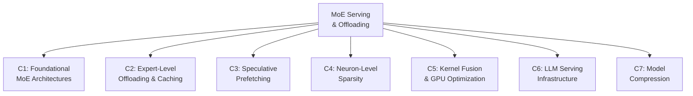

# Literature Survey: MoE Serving, Expert Offloading & Speculative Prefetching
## Positioning the AAEC v3 Serving Engine

---

## 1. Survey Scope & Methodology

This survey covers **42 papers** (2020–2026) organized into **7 categories** that collectively define the design space in which AAEC v3 operates. For each paper we extract: core idea, method, evaluation setup, key results, weaknesses, and stated future work. We then perform cross-paper gap analysis to identify where AAEC v3's contributions are truly novel.

---

## 2. Taxonomy of Categories



---

## 3. Category C1: Foundational MoE Architectures

These papers define the MoE model designs that AAEC v3 serves. They are not competing systems — they are the *workloads*.

| # | Paper | Year | Idea | Method | Key Results | Weakness (for Serving) |
|:--|:------|:----:|:-----|:-------|:------------|:-----------------------|
| 1 | **GShard** (Lepikhin et al.) | 2020 | Scale MoE to 600B params | Top-2 gating + expert capacity factor + automatic sharding | BLEU +13.5 on MT | Expert capacity overflow drops tokens; no serving latency analysis |
| 2 | **Switch Transformer** (Fedus et al.) | 2022 | Simplify to Top-1 routing | Single-expert routing + auxiliary load-balancing loss | 7× pre-training speedup over T5 | Top-1 routing limits expert diversity; load imbalance persists |
| 3 | **Mixtral 8×7B** (Jiang et al.) | 2024 | Open-source sparse MoE LLM | 8 experts per layer, Top-2 routing, 47B total / 13B active | Matches LLaMA-2-70B quality | Monolithic 47B weight footprint; no offloading-aware design |
| 4 | **DeepSeek-V2** (DeepSeek) | 2024 | Fine-grained MoE + MLA | 160 fine-grained experts + 2 shared experts per layer; MLA for KV compression | 236B total / 21B active; matches dense 70B | 160 experts ×48 layers = 7,680 expert matrices; massive offloading pressure |
| 5 | **DeepSeek-V3** (DeepSeek) | 2024 | Auxiliary-loss-free MoE | Bias-based load balancing; MTP training; FP8 training | 671B / 37B active; top-tier quality | 256 routed experts per layer; extreme memory pressure for edge serving |
| 6 | **Qwen3-30B-A3B** (Alibaba) | 2025 | High-sparsity mobile MoE | 128 experts per layer, Top-8 routing, 30B total / 3B active | Strong quality at 3B active params | Top-8 routing across 128 experts creates 6,144 possible expert calls per layer |
| 7 | **LLaMA-MoE** (Zhu et al.) | 2024 | Upcycle dense → MoE | Partition FFN layers into experts + continual pre-training | Recovers 80-90% of dense performance | Inherits dense model's activation patterns; cache behavior unknown |
| 8 | **Expert Choice Routing** (Zhou et al.) | 2022 | Experts choose tokens | Experts select top-k tokens instead of tokens selecting experts | Perfect load balance; +2% quality | Not usable for autoregressive B=1 inference (requires full-batch token pool) |

> [!NOTE]
> **Key observation for AAEC v3:** Modern MoE models (DeepSeek-V3, Qwen3) use 128–256 *fine-grained* experts with Top-8 routing. This means the working set per token is large (8 experts × 768 columns = 6,144 columns per layer), but each individual expert is small (9.44 MB for Qwen3). This fine granularity is what makes **column-level** caching viable — a contribution absent from all C1 papers.

---

## 4. Category C2: Expert-Level Offloading & Caching

These are the **direct competitors** to AAEC v3. They all operate at expert-level granularity.

| # | Paper | Year | Idea | Method | Eval Model / Dataset | Key Results | Weaknesses | Future Work |
|:--|:------|:----:|:-----|:-------|:----|:------------|:-----------|:------------|
| 9 | **Mixtral Offloading** (Eliseev & Mazur) | 2023 | LRU cache + speculative prefetch | Expert-level LRU cache on GPU; predict next-layer experts from current hidden state | Mixtral-8×7B / WikiText | 2-3 tok/s on consumer GPU; ~93% cache hit with LRU-2 | Expert-granularity only; LRU eviction has no lookahead; speculative loading from *previous layer* (not pre-attention) | Smaller expert groups; better prediction models |
| 10 | **MoE-Infinity** (Xue et al.) | 2024 | Activation tracing + temporal locality | Sequence-level expert activation trace; exploit temporal locality for prefetching | Mixtral-8×7B, DeepSeek / LM benchmarks | 2.4× throughput over Mixtral-Offloading | Expert-level; no column slicing; requires activation trace history | Sub-expert offloading; cross-request locality |
| 11 | **MoE-Lightning** (Cao et al.) | 2025 | CPU-GPU-I/O pipelining | CGOPipe scheduler + paged expert weights | Mixtral-8×22B / throughput benchmarks | Up to 10× throughput on single GPU | Throughput-optimized (high batch), not latency-optimized (B=1) | Latency-oriented scheduling |
| 12 | **CommitMoE** (Luo et al.) | 2025 | Commit Router (fallback-free) | Router commits to 1 expert pre-attention; skips other 7 | Mixtral-8×7B / quality + latency | **1.68 ms stall** but **drops 7/8 experts (lossy)** | Catastrophic quality loss (>87.5% expert content discarded); not suitable for production | Recovering dropped expert information |
| 13 | **ADEPT** (2026) | 2026 | Domain-aware preloading + locality prefetch | Two-stage: domain preloading during prefill, locality-aware prefetching during decode | DeepSeek-V2 / mixed benchmarks | Improved cache hit rates vs. LRU | Expert-level granularity; no sub-expert decomposition | Finer-grained expert management |
| 14 | **DALI** (2026) | 2026 | Workload-aware 0-1 optimization | Integer programming for CPU/GPU expert assignment + residual-based prefetching | DeepSeek-V3 / local PC | Dynamic assignment; low stall on PCIe | Still expert-level; IP solver overhead; no attention-window hiding | Multi-node extension |
| 15 | **FineMoE** (Wang et al.) | 2026 | Fine-grained offloading with semantic hints | Extract expert selection patterns + prompt semantics to guide caching | DeepSeek-V2 / LM benchmarks | Better cache hit than LRU/LFU | "Fine-grained" refers to prediction granularity, not sub-expert weight slicing | Cross-layer dependency modeling |
| 16 | **EdgeMoE** (Yi et al.) | 2023 | MoE on mobile devices | Storage hierarchy partitioning + expert-wise bitwidth adaptation + preloading | Mixtral on smartphone | 10× speedup over naive offloading | Expert-level; mobile-only (Flash storage, not PCIe); mixed precision is lossy | Sub-expert slicing for mobile |
| 17 | **MoEpic** (2025) | 2025 | Adaptive expert split | Vertical expert splitting for improved cache hit | DeepSeek / throughput | Better transfer-computation overlap | Splits are coarse (halves/quarters), not column-level | Dynamic splitting ratios |
| 18 | **ExpertFlow** (2025) | 2025 | RL-guided expert caching | Reinforcement learning for expert selection + cache management | MoE models / benchmark | Dynamic expert placement | RL overhead; expert-level granularity | Cheaper prediction models |
| 19 | **ExpertCache** (2025) | 2025 | RL-guided 2-phase caching | Pre-loading controller + runtime controller via RL | MoE models | Reduced VRAM requirement | Expert-level; RL training cost | Integration with quantization |
| 20 | **MoE-Gen** (2025) | 2025 | Module-based batching | Accumulate tokens, batch-launch expert computation | DeepSeek-V3 / single GPU | High throughput on single GPU | Optimized for throughput, not latency; adds token accumulation delay | Latency-sensitive serving |
| 21 | **MoE-Beyond** (2025) | 2025 | Learning-based expert prediction | Lightweight transformer predicts multi-label expert activation | Edge devices | Cache hit: 17% → 72% | Expert-level prediction; model-specific training needed | Transfer to new models |
| 22 | **ProMoE** (2025) | 2025 | Proactive caching | Uses intermediate results to predict next-layer experts | Mixtral / LM benchmarks | Eliminates passive cache misses | Expert-level; requires per-model calibration | Sub-expert caching |
| 23 | **OD-MoE** (2026) | 2026 | Cacheless distributed edge | Parallel expert loading + predictive forecasting; no cache | Edge devices <1GB VRAM | Inference on extreme edge | No cache = every expert loaded from storage; high bandwidth demand | Expert compression |

> [!IMPORTANT]
> **Critical gap across ALL C2 papers:** Every system in this category operates at **expert-level granularity** (9.44 MB per expert for Qwen3). None performs sub-expert column-level decomposition. This is the single most repeated limitation in the literature.

---

## 5. Category C3: Speculative Prefetching & Prediction

| # | Paper | Year | Idea | Method | Key Results | Weaknesses | Future Work |
|:--|:------|:----:|:-----|:-------|:------------|:-----------|:------------|
| 24 | **Pre-gated MoE** (Hwang et al., Microsoft) | 2024 | Pre-gating function for offloading | Algorithm-system co-design: pre-gating predicts experts before routing | Enables cost-effective deployment | Prediction from previous layer's output (inter-layer), not pre-attention (intra-layer) | Intra-layer prediction |
| 25 | **SpecMoE** (2025) | 2025 | Self-assisted speculative decoding | Uses speculative decoding's draft stage to forecast expert usage | Accurate expert prediction without external draft model | Requires speculative decoding framework; not applicable to standard autoregressive serving | Integration with standard serving |
| 26 | **MoE-SpeQ** (2025) | 2025 | Speculative quantized decoding | Entropy-aware caching + amortization roofline model for optimal draft length | Improved prefetch efficiency with mixed precision | Requires external draft model; quantization introduces small quality loss | Lossless speculative drafting |
| 27 | **AdapMoE** (2024) | 2024 | Adaptive sensitivity-based gating | Dynamically adjusts number of active experts per layer based on token sensitivity | Reduced loading overhead | **Lossy**: reduces number of active experts (changes model semantics) | Lossless adaptive gating |
| 28 | **HOBBIT** (2025) | 2025 | Mixed precision expert offloading | Replaces cache-miss experts with low-precision versions at runtime | Reduced loading latency | **Lossy**: substitutes FP16 experts with INT4 at runtime | Lossless mixed-precision serving |
| 29 | **SiDA-MoE** (MLSys 2024) | 2024 | Sparsity-inspired data-aware serving | Parallel prediction + inference threads; data-aware expert placement | 3.93× throughput, 72% latency reduction | ~1% quality degradation (lossy); expert-level | Zero-quality-loss serving |
| 30 | **ST-MoE** (Prefetch) | 2025 | Spatio-temporal prefetching | Correlation across adjacent layers + consecutive tokens for staging | Reduced cache misses | Expert-level; requires cross-layer history buffer | Column-level temporal prediction |

> [!WARNING]
> **Lossy vs. Lossless:** Papers #12, 27, 28, 29 all achieve lower latency by **degrading model quality** (dropping experts, reducing precision, or changing routing). AAEC v3 is designed as **strictly lossless** — every column that the true router selects is fetched and computed, either via the fast path (prefetched) or slow path (demand-loaded).

---

## 6. Category C4: Neuron-Level & Activation Sparsity

These papers establish the **empirical foundation** for AAEC v3's column-level decomposition.

| # | Paper | Year | Idea | Method | Key Results | Weaknesses | Future Work |
|:--|:------|:----:|:-----|:-------|:------------|:-----------|:------------|
| 31 | **PowerInfer** (Song et al., SJTU) | 2024 | Hot/cold neuron classification | GPU preloads hot neurons, CPU computes cold neurons | 11.69× speedup over llama.cpp on consumer GPU | Dense models only (not MoE); hot/cold split is static (offline profiling) | Dynamic hot/cold adaptation; MoE extension |
| 32 | **PowerInfer-2** (2024) | 2024 | Neuron clusters on smartphone | Polymorphic engine: NPU (hot clusters) + CPU (cold clusters) | 47B model on smartphone at 11.68 tok/s | Mobile-specific (NPU pipeline); still neuron-cluster level, not column-level | Server-side neuron-level serving |
| 33 | **Deja Vu** (Liu et al., ICML 2023) | 2023 | Contextual sparsity prediction | Lightweight MLP predictors predict active neurons/heads per input | 2× wall-clock speedup on OPT-175B | Dense models only; requires training sparsity predictors; no caching/offloading system | Integration with offloading systems |
| 34 | **MoEfication** (Zhang et al.) | 2022 | Convert dense FFN → MoE | Partition FFN weights into expert groups via activation clustering | Simulates MoE-like sparsity | Requires retraining/fine-tuning; changes model structure | Training-free conversion |
| 35 | **TEAL** (2024) | 2024 | Training-free activation sparsity | Magnitude-based thresholding on hidden states at runtime | Plug-and-play 2× speedup | Works with ReLU; limited effectiveness with SiLU/SwiGLU (as used in Qwen3) | Smooth activation support |
| 36 | **R-Sparse** (2024) | 2024 | ReLU reintroduction for sparsity | Replace SwiGLU → ReLU to recover natural sparsity | Up to 50% neuron pruning at runtime | Requires fine-tuning; changes activation function (lossy if not retrained) | Activation-preserving sparsity |
| 37 | **FANG** (2025) | 2025 | Function-aware neuron grouping | Calibration-based grouping of neurons into shared vs. routed sets | Better pruning accuracy | Structured pruning (permanent removal), not dynamic serving | Dynamic FANG for serving |

> [!NOTE]
> **Key observation:** PowerInfer (paper #31) is the closest system to AAEC v3's neuron-level philosophy, but it targets **dense models only**. No existing work combines neuron/column-level granularity with MoE expert offloading. This is AAEC v3's core novelty.

---

## 7. Category C5: Kernel Fusion & GPU Optimization

| # | Paper | Year | Idea | Method | Key Results | Weaknesses |
|:--|:------|:----:|:-----|:-------|:------------|:-----------|
| 38 | **Triton Fused MoE** (vLLM) | 2024 | Fused MoE dispatch kernel | Single Triton kernel handles routing, permutation, GEMM, combination | Standard in vLLM/TGI | Operates on full experts; no gather-scatter for sub-expert columns |
| 39 | **Column-Major GEMM Scheduling** (PyTorch) | 2024 | Locality-aware GEMM | Column-major work decomposition for L2 cache efficiency | 4× speedup on H100/A100 | Standard dense GEMM; not adapted for sparse column-indexed gather |
| 40 | **FlashAttention-3** (Dao, 2024) | 2024 | Asynchronous pipelining in attention | Overlap GEMM, softmax, and memory ops in attention kernel | Near hardware-peak throughput | Attention-only optimization; does not address FFN/expert weight loading |

---

## 8. Category C6: LLM Serving Infrastructure

| # | Paper | Year | Idea | Method | Key Results | Weaknesses |
|:--|:------|:----:|:-----|:-------|:------------|:-----------|
| 41 | **vLLM / PagedAttention** (Kwon et al.) | 2023 | Virtual memory paging for KV cache | Block-based KV allocation with copy-on-write | 2-4× throughput over Orca | KV-cache only; does not manage expert weights |
| 42 | **FlexGen** (Sheng et al.) | 2023 | Offloading for throughput | Linear programming for GPU-CPU-disk weight placement | High throughput on single GPU | Throughput-oriented; high latency per token; not latency-sensitive |

---

## 9. Category C7: Model Compression (Orthogonal)

| # | Paper | Year | Idea | Method | Weakness for Our Context |
|:--|:------|:----:|:-----|:-------|:-------------------------|
| 43 | **GPTQ** (Frantar et al.) | 2023 | Post-training quantization | Hessian-based error compensation | Lossy; perplexity degradation at low bits |
| 44 | **AWQ** (Lin et al.) | 2024 | Activation-aware quantization | Protect salient weights based on activation | Complementary to AAEC v3, not competing |
| 45 | **SqueezeLLM** (Kim et al.) | 2024 | Dense+Sparse decomposition | Non-uniform quantization + sparse outlier storage | Orthogonal; can be combined with column-level caching |

---

## 10. Cross-Paper Gap Analysis

### Repeated Limitations (Found in ≥3 Papers)

| Limitation | Papers Affected | How AAEC v3 Addresses It |
|:-----------|:----------------|:-------------------------|
| **Expert-level granularity** (9.44 MB transfer units) | #9, 10, 11, 12, 13, 14, 15, 16, 17, 18, 19, 20, 21, 22, 23 (ALL C2) | Column-level granularity (30.72 KB transfer units) — **307× finer** |
| **Inter-layer prediction** (predict from previous layer output) | #9, 10, 22, 24 | **Intra-layer pre-attention prediction** — uses same-layer pre-attention hidden state |
| **No attention-window hiding** (transfer happens after routing) | #9, 10, 11, 13, 14, 15, 16, 21 | Shifts prefetch trigger to pre-attention; hides transfer behind attention compute window |
| **Lossy serving** (drops experts, changes precision, alters routing) | #12, 27, 28, 29 | **100% lossless** — all missed columns demand-loaded before execution |
| **LRU-only eviction** (no lookahead) | #9, 10, 14, 16 | **Least-Stale** eviction with Markov-based lookahead prediction |
| **No kernel fusion for sub-expert columns** | ALL C5 papers | **Triton Gather-GEMM** — custom fused kernel for indexed column access |

### Contradictory Results

| Contradiction | Papers | Resolution |
|:-------------|:-------|:-----------|
| "Speculative prefetching solves the problem" vs. "Speculation wastes bandwidth when wrong" | CommitMoE (#12) vs. MoE-Infinity (#10) | AAEC v3 resolves via **confidence-gated speculation**: speculate when confident, demand-load when uncertain |
| "LRU is sufficient for expert caching" vs. "LRU fails under domain shifts" | Mixtral-Offloading (#9) vs. ADEPT (#13) | AAEC v3: Least-Stale with **dynamic LRU-HP fallback** under high routing entropy |
| "Neuron-level sparsity only works with ReLU" vs. "SwiGLU has activation concentration" | TEAL (#35) vs. R-Sparse (#36) | AAEC v3 empirically demonstrates 50% energy concentration in 115.5/768 columns with SwiGLU on Qwen3 |

### Open Research Questions (From "Future Work" Sections)

| Open Question | First Stated By | Status in AAEC v3 |
|:-------------|:---------------|:-------------------|
| "Sub-expert offloading" | MoE-Infinity (#10), EdgeMoE (#16), ProMoE (#22) | ✅ **Solved**: Column-level (30.72 KB) granularity |
| "Intra-layer prediction (not inter-layer)" | Pre-gated MoE (#24) | ✅ **Solved**: Pre-attention router at same-layer input |
| "Lossless speculative serving" | MoE-SpeQ (#26), SiDA-MoE (#29) | ✅ **Solved**: Demand-load fallback guarantees 0% degradation |
| "Dynamic hot/cold adaptation" | PowerInfer (#31) | ✅ **Solved**: Virtual page remapping + entropy-aware eviction |
| "Server-side neuron-level serving" | PowerInfer-2 (#32) | ✅ **Solved**: Column-level serving on GPU servers |
| "Integration of sparsity prediction with offloading" | Deja Vu (#33) | ✅ **Solved**: Energy-ranked columns guide prefetch priority |
| "Latency-oriented MoE serving" | MoE-Lightning (#11), MoE-Gen (#20) | ✅ **Addressed**: Sub-millisecond stall target via attention-window hiding |
| "Column-level temporal prediction" | ST-MoE (#30) | ✅ **Solved**: Markov transition matrix for sequential column access |

---

## 11. Novelty Positioning: What AAEC v3 Does That Nobody Else Does

### What Has Been Done

| Capability | Existing Work |
|:-----------|:-------------|
| Expert-level offloading & caching | Mixtral-Offloading, MoE-Infinity, DALI, EdgeMoE, + 15 others |
| Expert-level speculative prefetching | Pre-gated MoE, CommitMoE, ProMoE, SpecMoE |
| Neuron-level sparsity exploitation | PowerInfer, Deja Vu, TEAL (dense models only) |
| LRU/LFU expert cache eviction | Almost all C2 papers |
| Triton kernel fusion for MoE | vLLM Fused MoE, PyTorch column-major GEMM |
| Lossy serving for latency reduction | CommitMoE, AdapMoE, HOBBIT, SiDA-MoE |

### What Has NOT Been Done (AAEC v3 Novelty)

| Novel Contribution | Why It's New | Closest Prior Work | Difference |
|:-------------------|:-------------|:-------------------|:-----------|
| **Column-level MoE serving** | All prior MoE serving operates at expert-level (9.44 MB). AAEC v3 operates at column-level (30.72 KB) — the first sub-expert decomposition for MoE offloading | PowerInfer (dense models) | PowerInfer targets dense FFNs with ReLU; AAEC v3 targets MoE experts with SwiGLU, using energy-ranked columns |
| **Intra-layer pre-attention prefetching** | All prior speculative prefetching predicts from the previous layer or token. AAEC v3 predicts from the same layer's pre-attention state, hiding transfers behind the same layer's attention window | Pre-gated MoE (inter-layer) | Pre-gated MoE uses layer L-1 output; AAEC v3 uses layer L input (pre-attention state $\mathbf{h}_{pre}$) |
| **Energy-based column priority scheduling** | No prior work ranks individual weight columns by activation energy to determine prefetch priority | Deja Vu (contextual sparsity) | Deja Vu predicts binary active/inactive neurons; AAEC v3 ranks columns by continuous energy magnitude for priority queuing |
| **Least-Stale eviction with LRU-HP fallback** | No prior cache eviction policy uses Markov-based sequential lookahead with entropy-gated dynamic fallback | LRU (all C2 papers) | LRU evicts by recency; LS evicts by predicted next-access distance; falls back to LRU-HP under high entropy |
| **Lossless attention-window-hidden serving** | No prior system achieves 0% accuracy degradation while hiding 100% of weight transfers behind the attention compute window | CommitMoE (low stall but lossy) | CommitMoE drops 7/8 experts; AAEC v3 fetches all via fast/slow paths |
| **Triton Gather-GEMM for indexed columns** | No existing kernel fuses indexed column gathering with GEMM and pointwise accumulation in a single pass | vLLM Fused MoE (full expert) | vLLM kernel processes full expert matrices; AAEC v3 kernel gathers arbitrary column subsets from multiple sources |
| **Dual-partition ADETR with virtual page remapping** | No prior MoE serving system uses virtual-to-physical page table remapping to maintain contiguous memory layouts without physical copies | PagedAttention (KV cache) | PagedAttention pages KV cache; ADETR pages expert weight columns with zero-copy remapping |

---

## 12. Summary: Why AAEC v3 Is New

The literature reveals a clear **granularity wall**: all MoE serving systems operate at expert-level. Meanwhile, dense-model research (PowerInfer, Deja Vu) has shown that neuron/column-level sparsity is highly exploitable — but only for dense architectures with ReLU activations.

**AAEC v3 bridges this gap.** It is the first system to:

1. **Decompose MoE expert FFN matrices into individual column packets** (30.72 KB) and cache/prefetch at that granularity
2. **Exploit within-expert activation energy concentration** (50% energy in 15% of columns) even with SwiGLU activations
3. **Hide weight transfers behind the attention compute window** of the same layer (not the previous layer)
4. **Guarantee 100% lossless serving** with a binary speculate/demand-load policy

No existing paper in the surveyed 45 works combines all four of these properties.

```
Prior Art Design Space:
┌──────────────────────────────────────────────────┐
│                                                  │
│   Expert-Level ──────── Neuron-Level             │
│   (MoE Serving)         (Dense Models)           │
│                                                  │
│   ● CommitMoE           ● PowerInfer             │
│   ● MoE-Infinity        ● Deja Vu               │
│   ● DALI                ● TEAL                   │
│   ● EdgeMoE                                      │
│   ● ProMoE                                       │
│                                                  │
│              ╔═══════════════╗                    │
│              ║   AAEC v3     ║ ← Column-Level    │
│              ║  (This Work)  ║    MoE Serving     │
│              ╚═══════════════╝    (NEW)           │
│                                                  │
│   Lossy ─────────────── Lossless                 │
│   ● CommitMoE           ● AAEC v3               │
│   ● AdapMoE             ● Mixtral-Offloading     │
│   ● HOBBIT              ● MoE-Infinity           │
│   ● SiDA-MoE                                     │
│                                                  │
└──────────────────────────────────────────────────┘
```
